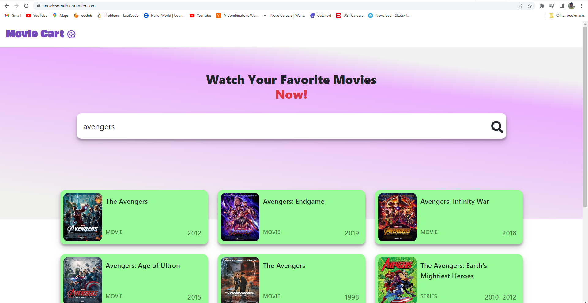

# React OMDB Application

This is a simple React application that utilizes the OMDB (Open Movie Database) API to display movie information. It allows users to search for movies, view details about a specific movie, and navigate between different movie pages.

## [Live-Demo](https://moviesomdb.onrender.com/)



# Basic Work Flow

Step 1: When a User Type Title And Hit The Search Icon , fetchResult thunk is called with argument title.

Step 2: fetchResults thunk function in resultSlice.ts fetch data from the omdb api .
As the promise get resolved state like result, loading and error Changes accordingly,

Step 3: In Hero.ts the states from fetchResuls are selected using useAppSelector hook.
And Reflects in UI.

Step4 : When we click on a movie It get us to the detaild page.Where Details are fetched by the params id.

## Features

- **Search**: Users can search for movies by entering a title in the search bar. The application will display a list of movies that match the search query.

- **Movie Details**: Clicking on a movie from the search results will navigate to the movie details page. This page shows additional information about the selected movie, such as the title, year, plot, and ratings.

## Screenshots

1. Search Page
   

2. Movie Details Page
   

## Installation

To run this application locally, follow these steps:

1. Clone the repository:

```bash

https://github.com/a-humanthing/Omdb-Search.git

cd Omdb-Search

npm install

```

2. Obtain an API key from OMDB by signing up at http://www.omdbapi.com/. Once you have the API key, create a new file called `.env` in the project root directory and add the following line, replacing `YOUR_API_KEY` with your actual API key:

3. Start Development Server:

```bash

npm run dev

```

4.  Dependencies

This application relies on the following dependencies:

- React: A JavaScript library for building user interfaces.
- React Router: A routing library for React applications.
- axios: A library for making HTTP requests.
- dotenv: A zero-dependency module for loading environment variables.
- Redux-toolkit: A global State Management System for react
- Asynthunk: Middleware used to fetch data from api's.
- React-icons: For Different Icons
